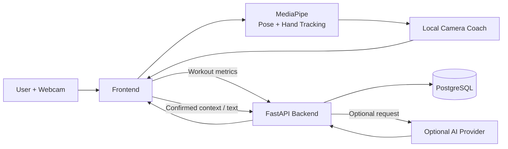

<div align="center">

#  Dungeon Master

### Gesture-controlled AI fitness coach powered by local computer vision

Dungeon Master turns your webcam into an interactive fitness coach.  
Control the application with hand gestures, receive real-time exercise feedback, build personalized workout plans and track your progress — while camera processing stays on your device.

<br>

[](https://www.python.org/)
[](https://fastapi.tiangolo.com/)
[](https://www.postgresql.org/)
[](https://vite.dev/)
[](https://www.docker.com/)
[](https://ai.google.dev/edge/mediapipe)

<br>

### [Live Demo](https://dungeon-master.helpmake-id.live) · [Local App Setup](#local-development) · [Hosted API Docs](https://api.dungeon-master.helpmake-id.live/docs) · [Figma](https://www.figma.com/design/vFIK97vQDk4xasLgDUdVdN?node-id=6-635)

**On your first visit to the Live Demo, keep the page open while the browser
downloads and initializes the models and assets needed for gesture control. Wait
until gesture recognition is ready before using hand gestures. Loading time depends
on your internet connection. Camera processing stays on your device.**

</div>

---

##  Demo

### Gesture-controlled interface

Navigate through Dungeon Master without touching your keyboard.

<p align="center">
  
</p>

### Real-time workout experience

The camera detects body and hand landmarks locally and provides immediate workout feedback.

<p align="center">
  
</p>

---

##  What is Dungeon Master?

**Dungeon Master** is a hackathon prototype of a privacy-focused AI fitness coach.

Instead of requiring constant mouse, keyboard or touchscreen interaction, the application uses your webcam and hand gestures to control the interface.

The project combines:

-  gesture recognition;
-  real-time pose analysis;
-  exercise coaching;
-  AI-generated workout plans;
-  workout progress tracking;
-  document-based personalization;
-  local camera processing;
-  offline-friendly workout behavior.

The goal is to create a fitness experience where the user can interact naturally while exercising without repeatedly touching another device.

---

##  Key Features

###  Gesture Control

Dungeon Master recognizes hand gestures and allows the user to navigate the application while standing away from the computer.

Current controls include:

- pointer / pinch interaction;
- **Fist** — go back;
- **Thumb Up** — confirm;
- **Two fingers** — scroll vertically with index and middle fingers extended;
- **Both hands raised while standing in a workout** — pause or resume;
- camera-based menu navigation.

---

###  Local Camera Coach

The frontend performs camera processing locally using pose and gesture recognition.

The system can:

- detect body landmarks;
- detect hand landmarks;
- count repetitions;
- analyze exercise execution;
- provide immediate feedback;
- run exercise-specific coaching rules.

The existing **Bodyweight Squat** flow remains available as the deterministic
demonstration exercise. Planned workouts also support multiple exercises and sets;
unsupported camera analysis uses manual completion or timers without claiming
automatic technique assessment. Real webcam reliability still requires the
[manual camera checks](docs/SPRINT_2_MANUAL_CHECKLIST.md).

---

###  AI Personalization

Dungeon Master can build a personalized fitness profile from:

- user context;
- confirmed document facts;
- existing profile information;
- previous progress.

The AI layer can generate:

- personal AI profiles;
- workout plans;
- exercise variants;
- training volume;
- tempo;
- rest periods;
- camera angles;
- coaching messages;
- `MovementSpec` declarations.

Generated exercise declarations are interpreted by the generic pose engine on the client.

AI functionality is optional and can be disabled completely.

---

### Voice and Schedule

Sprint 4B includes:

- account voice selection and cached ElevenLabs coaching clips;
- browser speech and visual feedback when provider audio is unavailable;
- explicit push-to-talk coach input, limited to 30 seconds and 4 MB;
- coach proposals that require confirmation before applying changes;
- internal schedules, timezone and availability settings, and ICS export;
- optional Google Calendar connection and synchronization through OAuth.

Live provider features depend on backend configuration and credentials. Internal
scheduling works without Google Calendar. See the
[provider checklist](docs/LIVE_PROVIDER_CHECKLIST.md) for remaining live checks.

---

###  Source-linked Knowledge

Dungeon Master supports text extraction from:

- PDF;
- TXT;
- Markdown.

Processed information can be stored and retrieved using:

- PostgreSQL;
- document chunks;
- JSONB embeddings;
- cosine similarity retrieval;
- lexical fallback.

This allows workout plans to use confirmed source information instead of relying only on a generic prompt.

---

### Progress Tracking

Completed workouts can be synchronized with the backend.

The application stores:

- workout sessions;
- repetition counts;
- exercise metrics;
- error counts;
- timestamps;
- progress history.

Results are shown immediately without waiting for the server response.

---

###  Offline-friendly Behavior

Core workout functionality can continue working even when the backend is temporarily unavailable.

Dungeon Master supports:

- local workout execution;
- local camera feedback;
- temporary session queue;
- automatic retry after reconnecting;
- locally saved profile drafts;
- cached progress.

Up to **20 pending workout sessions** can be stored locally before synchronization.

---

##  Privacy by Design

Camera processing is designed to stay inside the browser.

### What stays local

- camera frames;
- images;
- raw pose landmarks;
- raw hand landmarks;
- live exercise analysis.

### What can be sent to the backend

Workout synchronization sends compact information such as:

- identifiers;
- timestamps;
- repetition counts;
- error counts;
- exercise metrics.

Camera recordings are not uploaded to the backend.

Profile/context input, optional uploaded documents and confirmed facts are also
sent to the backend for personalization. The configured LLM may receive text
context used for personalization. Explicit push-to-talk records microphone audio
and uploads it to the backend for OpenAI transcription; microphone access starts
only after the user activates that control. **AI does not analyze the camera feed
or workout video**.

---

##  How It Works



The webcam never needs to send frames to the backend or AI provider.

---

##  Architecture

The repository is divided into two main applications:

```text
dungeon-master/
│
├── backend/
│   ├── src/
│   ├── tests/
│   ├── docs/
│   ├── Dockerfile
│   ├── docker-compose.yml
│   ├── alembic.ini
│   └── pyproject.toml
│
├── frontend/
│   ├── src/
│   ├── public/
│   ├── tests/
│   ├── package.json
│   ├── vite.config.ts
│   └── vitest.config.ts
│
├── docs/
│   └── readme-assets/
│
├── deploy/
├── scripts/
├── Makefile
└── README.md
```

### Frontend responsibilities

The frontend owns:

- camera access;
- MediaPipe;
- gesture recognition;
- pose analysis;
- exercise rules;
- immediate workout results;
- offline session handling.

### Backend responsibilities

The backend owns:

- guest identity;
- user profile;
- workout catalog;
- workout plans;
- sessions;
- progress queries;
- persistence;
- AI orchestration.

The API follows the existing:

```text
FastAPI
   ↓
Schemas
   ↓
Controllers
   ↓
Models
   ↓
SQLAlchemy Core
   ↓
PostgreSQL
```

architecture.

---

## 🛠️ Tech Stack

| Layer            | Technology                     |
| ---------------- | ------------------------------ |
| Frontend         | React, TypeScript, Vite        |
| Computer Vision  | MediaPipe                      |
| Backend          | Python 3.12+, FastAPI          |
| Database         | PostgreSQL                     |
| Database Access  | SQLAlchemy Core                |
| Migrations       | Alembic                        |
| AI               | OpenAI Structured Outputs      |
| Embeddings       | Vector / JSONB based retrieval |
| Containerization | Docker, Docker Compose         |
| Testing          | Pytest / Vitest                |
| Deployment       | Docker-based VPS deployment    |
| CI/CD            | GitHub Actions                 |

---

#  Local Development

For local development, run the frontend and visual recognition on your computer
and use the hosted backend through a local proxy. No local backend or database is
needed for this workflow. You can also use the
[Live Demo](https://dungeon-master.helpmake-id.live) directly in your browser.
Provider availability depends on the server's current configuration.

## Requirements

For the local frontend:

- Node.js **22.12+** and npm;
- a webcam and a current Chrome or Edge browser;
- internet access for dependency installation, the first model download and hosted APIs.

Camera access requires `localhost` or HTTPS. A laptop's plain HTTP LAN address
does not provide camera access on a phone.

For optional backend development, also install Python **3.12+**, Docker / Docker
Compose, and PostgreSQL client tools for database administration and tests.

## 1. Clone the Repository

```bash
git clone https://github.com/EZDAMIR/dungeon-master.git
cd dungeon-master
```

## 2. Start the Frontend with the Hosted API

```bash
cd frontend
npm ci
npm run dev:cloud
```

Open **http://localhost:5173**. The committed public `.env.cloud` sets the API
prefix to `/api/v1` and Vite proxies it to
`https://api.dungeon-master.helpmake-id.live`. Camera frames stay on your computer.
For a local production preview, run:

```bash
npm run build:cloud
npm run preview:cloud
```

Open **http://localhost:4173** for the preview.
See [local app setup](frontend/README.md) and [API deployment](deploy/README.md).

## Backend API Documentation

Hosted Swagger / OpenAPI:
[api.dungeon-master.helpmake-id.live/docs](https://api.dungeon-master.helpmake-id.live/docs).

---

## Optional: Start a Local Backend

From the repository root, enter the backend directory:

```bash
cd backend
```

Create the Python environment:

```bash
python3 -m venv .venv
```

Create local environment configuration:

```bash
cp .env.example .env
```

Set a random `SECRET_KEY` of at least **32 characters** inside:

```text
backend/.env
```

Example:

```dotenv
SECRET_KEY=replace-this-with-your-own-random-development-secret
```

### Using the project Makefile

```bash
make install
make up
make migrate
```

`make up` starts PostgreSQL and the backend application.

The API will be available at:

```text
http://localhost:8000
```

Swagger / OpenAPI:

```text
http://localhost:8000/docs
```

### Docker Compose

Docker users can also start the backend stack from the `backend` directory:

```bash
docker compose up --build
```

In another terminal, run `make migrate` from `backend` to apply the schema.

---

## Optional: Connect the Frontend to the Local Backend

Open another terminal at the repository root:

```bash
cd frontend
```

Install dependencies:

```bash
npm ci
```

Create frontend environment configuration:

```bash
cp .env.example .env
```

Start Vite:

```bash
npm run dev
```

Open:

```text
http://localhost:5173
```

The frontend API prefix defaults to:

```text
/api/v1
```

Ordinary `npm run dev` proxies API requests to `http://127.0.0.1:8000` by default.
Remove any `VITE_API_PROXY_TARGET` override in ignored local environment files
when switching back from the hosted API. To use the hosted API, use
`npm run dev:cloud` as shown above.

---

#  Jury Demo

Dungeon Master includes synthetic demo personas for presentations and hackathon demonstrations.

Start the frontend and open:

```text
http://localhost:5173/?juryDemo=1
```

The demo provides synthetic profiles such as:

- Maya;
- Arman;
- Dana.

Different profiles demonstrate different:

- schedules;
- exercises;
- workout volumes;
- coaches;
- routines.

These profiles are synthetic fixtures and do not represent real users.

---

##  Optional AI Setup

AI plan generation is disabled by default in the backend settings and example
environment. The hosted server is configured independently; no provider keys are
needed in the frontend.

To test live generation with your own backend, configure its environment:

```dotenv
AI_FEATURE_ENABLED=true

OPENAI_API_KEY=<your-local-api-key>

OPENAI_MODEL=<structured-output-compatible-model>

OPENAI_EMBEDDING_MODEL=<embedding-model>
```

The host-run backend (`make dev` from `backend`) reads `backend/.env`. When using
Docker, pass provider settings into the backend container explicitly; the
development Compose file does not forward those settings automatically.

Never commit API keys or `.env` files to GitHub.

Without an AI provider, the deterministic workout plan and stable squat analyzer remain available.

---

##  Environment Variables

| Variable                      | Location        | Purpose                         |
| ----------------------------- | --------------- | ------------------------------- |
| `VITE_API_BASE_URL`           | Frontend `.env` | Backend API prefix              |
| `VITE_API_PROXY_TARGET`       | Frontend `.env` | Vite dev/preview API proxy target |
| `CORS_ORIGINS`                | Backend `.env`  | Allowed frontend origins        |
| `DATABASE_URL`                | Backend `.env`  | Development PostgreSQL database |
| `TEST_DATABASE_URL`           | Backend `.env`  | Separate test database          |
| `SECRET_KEY`                  | Backend `.env`  | JWT signing secret              |
| `ACCESS_TOKEN_EXPIRE_MINUTES` | Backend `.env`  | Guest token lifetime            |
| `AI_FEATURE_ENABLED`          | Backend `.env`  | Enable AI features              |
| `OPENAI_API_KEY`              | Backend `.env`  | Optional OpenAI API key         |
| `ELEVENLABS_ENABLED`          | Backend `.env`  | Enable account voice integration |
| `ELEVENLABS_API_KEY`          | Backend `.env`  | Optional ElevenLabs API key     |
| `VOICE_INPUT_ENABLED`         | Backend `.env`  | Enable push-to-talk transcription |
| `GOOGLE_CALENDAR_ENABLED`     | Backend `.env`  | Enable configured Google OAuth  |
| `APP_PUBLIC_URL`              | Backend `.env`  | Trusted app origin for guest recovery |

See [backend/.env.example](backend/.env.example) for the complete provider, OAuth,
audio-cache and guest-recovery settings. Provider secrets belong only in backend
configuration; `VITE_*` values are public.

---

#  Testing & Verification

### Backend

```bash
cd backend

make check

make test

make migrate
```

### Frontend

```bash
cd frontend

npm run lint

npm run type-check

npm run test

npm run test:coverage

npm run build
```

### Full project checks

From the repository root:

```bash
make check
```

Full CI verification:

```bash
make ci
```

---

##  Design

Dungeon Master's visual system is based on the project's Motion Studio design.

### Figma

[Open Dungeon Master in Figma](https://www.figma.com/design/vFIK97vQDk4xasLgDUdVdN?node-id=6-635)

The interface uses a minimal warm-ivory design system with a graphite / citron visual identity.

---

##  Deployment

The deployed application is available at
[dungeon-master.helpmake-id.live](https://dungeon-master.helpmake-id.live).
Open it in your browser without a local installation. The frontend processes
camera frames on your device; the VPS hosts the backend and PostgreSQL.

For local development, use `npm run dev:cloud` or the local production preview
described above.

Hosted API: **https://api.dungeon-master.helpmake-id.live**.

GitHub Actions runs automated verification before deployment.

The deployment pipeline includes:

```text
CI
 ↓
Smoke Tests
 ↓
CD
 ↓
VPS
```

CI checks both the frontend and the backend. See
[deployment and operations](deploy/README.md) for deployment tooling; its
API-only hosting description is outdated and does not describe the working
Live Demo.

---

##  Prototype Scope

Dungeon Master is a **hackathon prototype**.

It provides general fitness feedback and does **not** provide:

- medical diagnosis;
- medical treatment;
- rehabilitation;
- medical recommendations;
- replacement for a qualified trainer or medical professional.

Custom AI camera coaching is experimental.

OCR for scanned documents is not implemented. PDF personalization uses extractable
text. ElevenLabs voice playback, push-to-talk transcription and optional Google
Calendar integration are implemented, but configuration does not establish live
acceptance. Physical-device/Safari checks, full live provider flows, Kazakh audio
and Google OAuth/test-calendar verification remain pending as recorded in the
[Sprint 4B release report](docs/SPRINT_4B_RELEASE_REPORT.md).

Use synthetic information when demonstrating the application.

---

##  Pre-existing Scaffold

The backend began with
[EZDAMIR/fastapi-backend-starter](https://github.com/EZDAMIR/fastapi-backend-starter).
Its FastAPI structure, SQLAlchemy Core model conventions, Alembic setup, Docker
configuration, development tooling and layer instruction files were reused and
extended. Dungeon Master adds the React frontend, local gesture/pose runtime,
fitness domain APIs, persistence, personalization, voice and scheduling features.
Instruction provenance is recorded in
[backend/docs/starter-instructions.json](backend/docs/starter-instructions.json).

---

##  Security Notes

Never commit:

```text
.env
API keys
JWT tokens
database dumps
camera recordings
personal health information
```

Guest JWTs are used for demo authentication and should not be treated as production account security.

---

<div align="center">

## Dungeon Master

### Train. Move. Control.

Gesture-driven fitness coaching powered by local computer vision.

<br>

**Built as a hackathon prototype.**

<br>

[Live Demo](https://dungeon-master.helpmake-id.live) ·
[Local App Setup](#local-development) ·
[Hosted API Docs](https://api.dungeon-master.helpmake-id.live/docs) ·
[Figma](https://www.figma.com/design/vFIK97vQDk4xasLgDUdVdN) ·
[Repository](https://github.com/EZDAMIR/dungeon-master)

</div>
