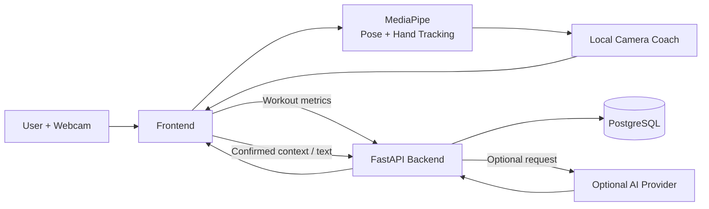

<div align="center">

Current hosting: run the app and visual recognition locally. The VPS serves the
OpenAI/ElevenLabs and persistence APIs only; public app routes return 404.

```bash
cd frontend
npm ci
npm run dev:cloud
```

Open **http://localhost:5173**. No local backend/database is needed. The first run
prepares verified model assets; camera frames stay on your computer. For a local
production preview use `npm run build:cloud` and `npm run preview:cloud`.
See [local app setup](frontend/README.md) and [API deployment](deploy/README.md).
The backend setup below is optional for full local development.

# Local Development

> **Note:** For normal local testing, you only need to run the frontend with `npm run dev:cloud`.  
> The backend, database, OpenAI, and ElevenLabs integrations are already hosted on the project server and do not need to be configured locally. Full local backend setup is optional.

## Requirements


#  Dungeon Master

### Gesture-controlled AI fitness coach powered by local computer vision

Dungeon Master turns your webcam into an interactive fitness coach.  
Control the application with hand gestures, receive real-time exercise feedback, build personalized workout plans and track your progress — while camera processing stays on your device.

<br>

[](https://www.python.org/)
[](https://fastapi.tiangolo.com/)
[](https://www.postgresql.org/)
[](https://vite.dev/)
[](https://www.docker.com/)
[](https://ai.google.dev/edge/mediapipe)

<br>

### [Live Demo](https://dungeon-master.helpmake-id.live) · [Figma](https://www.figma.com/design/vFIK97vQDk4xasLgDUdVdN?node-id=6-635)

</div>

---

##  Demo

### Gesture-controlled interface

Navigate through Dungeon Master without touching your keyboard.

<p align="center">
  
</p>

### Real-time workout experience

The camera detects body and hand landmarks locally and provides immediate workout feedback.

<p align="center">
  
</p>

---

##  What is Dungeon Master?

**Dungeon Master** is a hackathon prototype of a privacy-focused AI fitness coach.

Instead of requiring constant mouse, keyboard or touchscreen interaction, the application uses your webcam and hand gestures to control the interface.

The project combines:

-  gesture recognition;
-  real-time pose analysis;
-  exercise coaching;
-  AI-generated workout plans;
-  workout progress tracking;
-  document-based personalization;
-  local camera processing;
-  offline-friendly workout behavior.

The goal is to create a fitness experience where the user can interact naturally while exercising without repeatedly touching another device.

---

##  Key Features

###  Gesture Control

Dungeon Master recognizes hand gestures and allows the user to navigate the application while standing away from the computer.

Current controls include:

- pointer / pinch interaction;
- **Fist** — go back;
- **Thumb Up** — confirm;
- camera-based menu navigation.

---

###  Local Camera Coach

The frontend performs camera processing locally using pose and gesture recognition.

The system can:

- detect body landmarks;
- detect hand landmarks;
- count repetitions;
- analyze exercise execution;
- provide immediate feedback;
- run exercise-specific coaching rules.

The existing **Bodyweight Squat** flow remains available as a stable demonstration exercise.

---

###  AI Personalization

Dungeon Master can build a personalized fitness profile from:

- user context;
- confirmed document facts;
- existing profile information;
- previous progress.

The AI layer can generate:

- personal AI profiles;
- workout plans;
- exercise variants;
- training volume;
- tempo;
- rest periods;
- camera angles;
- coaching messages;
- `MovementSpec` declarations.

Generated exercise declarations are interpreted by the generic pose engine on the client.

AI functionality is optional and can be disabled completely.

---

###  Source-linked Knowledge

Dungeon Master supports text extraction from:

- PDF;
- TXT;
- Markdown.

Processed information can be stored and retrieved using:

- PostgreSQL;
- document chunks;
- JSONB embeddings;
- cosine similarity retrieval;
- lexical fallback.

This allows workout plans to use confirmed source information instead of relying only on a generic prompt.

---

### Progress Tracking

Completed workouts can be synchronized with the backend.

The application stores:

- workout sessions;
- repetition counts;
- exercise metrics;
- error counts;
- timestamps;
- progress history.

Results are shown immediately without waiting for the server response.

---

###  Offline-friendly Behavior

Core workout functionality can continue working even when the backend is temporarily unavailable.

Dungeon Master supports:

- local workout execution;
- local camera feedback;
- temporary session queue;
- automatic retry after reconnecting;
- locally saved profile drafts;
- cached progress.

Up to **20 pending workout sessions** can be stored locally before synchronization.

---

##  Privacy by Design

Camera processing is designed to stay inside the browser.

### What stays local

- camera frames;
- images;
- raw pose landmarks;
- raw hand landmarks;
- live exercise analysis.

### What can be synchronized

Only compact workout information such as:

- identifiers;
- timestamps;
- repetition counts;
- error counts;
- exercise metrics.

Camera recordings are not uploaded to the backend.

The configured LLM may receive confirmed text context used for personalization, but **AI does not analyze the camera feed or workout video**.

---

##  How It Works



The webcam never needs to send frames to the backend or AI provider.

---

##  Architecture

The repository is divided into two main applications:

```text
dungeon-master/
│
├── backend/
│   ├── src/
│   ├── tests/
│   ├── docs/
│   ├── Dockerfile
│   ├── docker-compose.yml
│   ├── alembic.ini
│   └── pyproject.toml
│
├── frontend/
│   ├── src/
│   ├── public/
│   ├── tests/
│   ├── package.json
│   ├── vite.config.ts
│   └── vitest.config.ts
│
├── docs/
│   └── readme-assets/
│
├── deploy/
├── scripts/
├── Makefile
└── README.md
```

### Frontend responsibilities

The frontend owns:

- camera access;
- MediaPipe;
- gesture recognition;
- pose analysis;
- exercise rules;
- immediate workout results;
- offline session handling.

### Backend responsibilities

The backend owns:

- guest identity;
- user profile;
- workout catalog;
- workout plans;
- sessions;
- progress queries;
- persistence;
- AI orchestration.

The API follows the existing:

```text
FastAPI
   ↓
Schemas
   ↓
Controllers
   ↓
SQLAlchemy Core
   ↓
PostgreSQL
```

architecture.

---

## 🛠️ Tech Stack

| Layer            | Technology                     |
| ---------------- | ------------------------------ |
| Frontend         | TypeScript, Vite               |
| Computer Vision  | MediaPipe                      |
| Backend          | Python 3.12+, FastAPI          |
| Database         | PostgreSQL                     |
| Database Access  | SQLAlchemy Core                |
| Migrations       | Alembic                        |
| AI               | OpenAI Structured Outputs      |
| Embeddings       | Vector / JSONB based retrieval |
| Containerization | Docker, Docker Compose         |
| Testing          | Pytest / Vitest                |
| Deployment       | Docker-based VPS deployment    |
| CI/CD            | GitHub Actions                 |

---

#  Local Development

## Requirements

Before running the project, install:

- Python **3.12+**
- Node.js **22.12+**
- Docker Desktop / Docker Compose
- PostgreSQL client tools for the complete backend development workflow

---

## 1. Clone the Repository

```bash
git clone https://github.com/EZDAMIR/dungeon-master.git
cd dungeon-master
```

---

## 2. Start Backend

Enter the backend directory:

```bash
cd backend
```

Create the Python environment:

```bash
python3 -m venv .venv
```

Create local environment configuration:

```bash
cp .env.example .env
```

Set a random `SECRET_KEY` of at least **32 characters** inside:

```text
backend/.env
```

Example:

```dotenv
SECRET_KEY=replace-this-with-your-own-random-development-secret
```

### Using the project Makefile

```bash
make install
make up
make migrate
```

`make up` starts PostgreSQL and the backend application.

The API will be available at:

```text
http://localhost:8000
```

Swagger / OpenAPI:

```text
http://localhost:8000/docs
```

### Docker Compose

Docker users can also start the backend stack from the `backend` directory:

```bash
docker compose up --build
```

---

## 3. Start Frontend

Open another terminal:

```bash
cd frontend
```

Install dependencies:

```bash
npm ci
```

Create frontend environment configuration:

```bash
cp .env.example .env
```

Start Vite:

```bash
npm run dev
```

Open:

```text
http://localhost:5173
```

The frontend API URL defaults to:

```text
http://localhost:8000/api/v1
```

---

#  Jury Demo

Dungeon Master includes synthetic demo personas for presentations and hackathon demonstrations.

Start the frontend and open:

```text
http://localhost:5173/?juryDemo=1
```

The demo provides synthetic profiles such as:

- Maya;
- Arman;
- Dana.

Different profiles demonstrate different:

- schedules;
- exercises;
- workout volumes;
- coaches;
- routines.

These profiles are synthetic fixtures and do not represent real users.

---

##  Optional AI Setup

AI features are disabled by default.

To test live generation, configure:

```dotenv
AI_FEATURE_ENABLED=true

OPENAI_API_KEY=<your-local-api-key>

OPENAI_MODEL=<structured-output-compatible-model>

OPENAI_EMBEDDING_MODEL=<embedding-model>
```

Never commit API keys or `.env` files to GitHub.

Without an AI provider, the deterministic workout plan and stable squat analyzer remain available.

---

##  Environment Variables

| Variable                      | Location        | Purpose                         |
| ----------------------------- | --------------- | ------------------------------- |
| `VITE_API_BASE_URL`           | Frontend `.env` | Backend API prefix              |
| `CORS_ORIGINS`                | Backend `.env`  | Allowed frontend origins        |
| `DATABASE_URL`                | Backend `.env`  | Development PostgreSQL database |
| `TEST_DATABASE_URL`           | Backend `.env`  | Separate test database          |
| `SECRET_KEY`                  | Backend `.env`  | JWT signing secret              |
| `ACCESS_TOKEN_EXPIRE_MINUTES` | Backend `.env`  | Guest token lifetime            |
| `AI_FEATURE_ENABLED`          | Backend `.env`  | Enable AI features              |
| `OPENAI_API_KEY`              | Backend `.env`  | Optional OpenAI API key         |

---

#  Testing & Verification

### Backend

```bash
cd backend

make check

make test

make migrate
```

### Frontend

```bash
cd frontend

npm run lint

npm run type-check

npm run test

npm run test:coverage

npm run build
```

### Full project checks

From the repository root:

```bash
make check
```

Full CI verification:

```bash
make ci
```

---

##  Design

Dungeon Master's visual system is based on the project's Motion Studio design.

### Figma

[Open Dungeon Master in Figma](https://www.figma.com/design/vFIK97vQDk4xasLgDUdVdN?node-id=6-635)

The interface uses a minimal warm-ivory design system with a graphite / citron visual identity.

---

##  Deployment

Production deployment:

### https://dungeon-master.helpmake-id.live

GitHub Actions runs automated verification before deployment.

The deployment pipeline includes:

```text
CI
 ↓
Smoke Tests
 ↓
CD
 ↓
VPS
```

Deployment documentation is available in:

```text
deploy/README.md
```

---

##  Prototype Scope

Dungeon Master is a **hackathon prototype**.

It provides general fitness feedback and does **not** provide:

- medical diagnosis;
- medical treatment;
- rehabilitation;
- medical recommendations;
- replacement for a qualified trainer or medical professional.

Custom AI camera coaching is experimental.

The current prototype does not include:

- microphone capture;
- OCR;
- ElevenLabs;
- calendar integration.

Use synthetic information when demonstrating the application.

---

##  Security Notes

Never commit:

```text
.env
API keys
JWT tokens
database dumps
camera recordings
personal health information
```

Guest JWTs are used for demo authentication and should not be treated as production account security.

---

<div align="center">

## Dungeon Master

### Train. Move. Control.

Gesture-driven fitness coaching powered by local computer vision.

<br>

**Built as a hackathon prototype.**

<br>

[Live Demo](https://dungeon-master.helpmake-id.live) ·
[Figma](https://www.figma.com/design/vFIK97vQDk4xasLgDUdVdN) ·
[Repository](https://github.com/EZDAMIR/dungeon-master)

</div>
