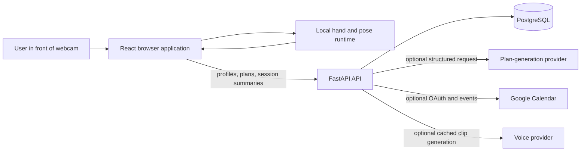
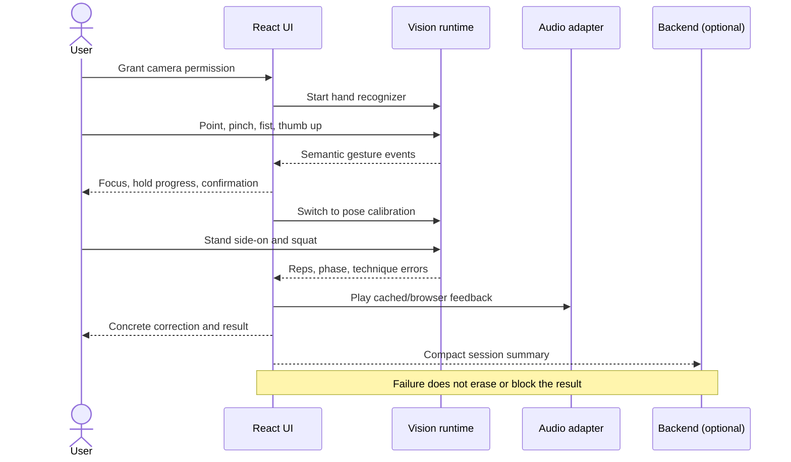
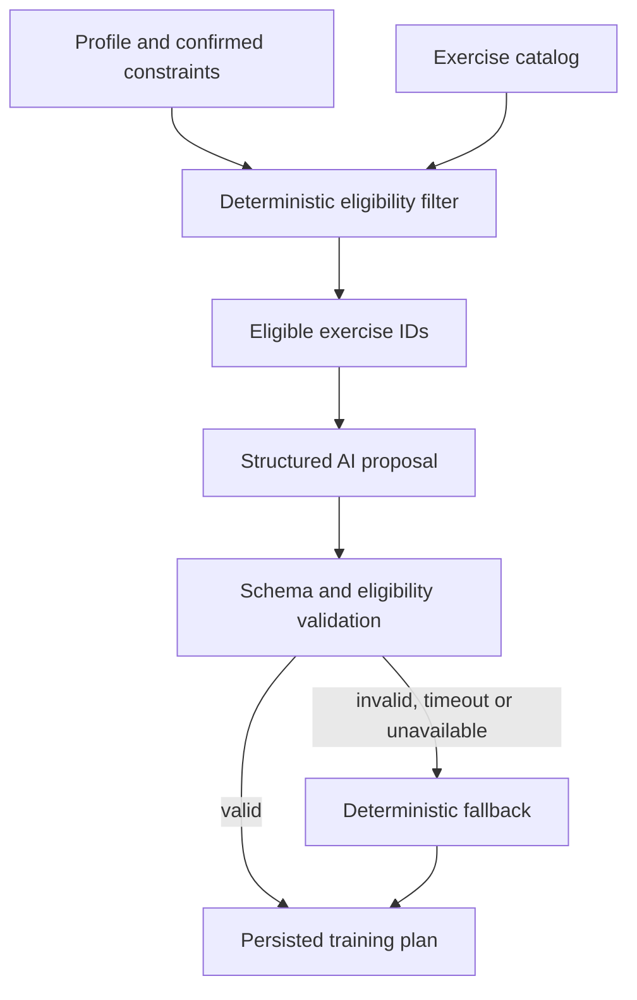

# Dungeon Master Architecture

## 1. Architectural goal

The system must provide a complete, reliable gesture-controlled fitness flow in a
browser while keeping real-time visual processing local. Backend and third-party
integrations enrich the product but do not sit on the critical path of movement
recognition.

## 2. System context



Raw camera frames stay between the browser and the local visual runtime.

## 3. Critical-path architecture



## 4. Frontend architecture

### Application modes

```text
BOOT
  -> CAMERA_PERMISSION
  -> TUTORIAL
  -> MENU
  -> CALIBRATION
  -> COUNTDOWN
  -> WORKOUT
  -> PAUSED
  -> RESULTS
```

The top-level mode machine determines which recognizer and commands are active.
This prevents exercise movement from accidentally triggering menu controls.

### Layers

| Layer | Owns | Does not own |
|---|---|---|
| `app/` | startup, providers, route and mode orchestration | landmark math |
| `pages/` | route composition | business or vision rules |
| `features/` | feature UI, low-frequency state and actions | inference internals |
| `vision/` | camera samples, geometry, state machines and semantic events | React and backend calls |
| `audio/` | browser speech and cached clip playback | technique policy |
| `api/` | typed HTTP client | visual events |
| `store/` | profile, selected plan and session summary | frame-by-frame values |
| `shared/` | generic UI and utilities | feature-specific rules |

### Visual event boundary

The visual core publishes semantic events rather than operating the UI directly.
UI code maps events to application actions.

Example:

```text
gesture.confirmed { command: "select", targetId: "start-squat" }
  -> app action START_CALIBRATION
  -> route/mode update
  -> recognizer switch
```

## 5. Backend architecture

The existing backend contract remains authoritative:

```text
HTTP endpoint
  -> Pydantic schema
  -> controller
  -> model function
  -> PostgreSQL
```

External provider flow:

```text
endpoint
  -> controller loads primitive data through model functions
  -> transaction ends
  -> controller calls provider adapter
  -> controller validates business outcome
  -> one model function persists final result
```

Network I/O never occurs inside an open database transaction.

### Backend domains

- `users`: guest and future registered identities.
- `profiles`: goal, experience, schedule, equipment and locale.
- `exercises`: allowlisted catalog and analysis metadata.
- `training_plans`: generated or deterministic plans and plan items.
- `workout_sessions`: session and set summaries.
- `progress`: aggregate read queries.
- `integrations`: OAuth connections and calendar links.
- `voice_assets`: optional cache metadata.

## 6. AI plan generation



The model never receives freedom to invent exercises outside the catalog.

## 7. Session-summary contract

The browser may send:

- exercise key;
- timestamps and total duration;
- total and accepted repetitions;
- aggregate phase durations;
- error-code counts;
- aggregate visibility or angle values;
- visual-engine version.

The browser does not send:

- video;
- still images;
- continuous raw landmarks;
- audio recordings;
- inferred diagnoses.

## 8. Reliability strategy

| Dependency failure | Required behavior |
|---|---|
| Backend unavailable | Local workout and result remain usable |
| AI unavailable | Deterministic seeded plan |
| Calendar unavailable | Show retryable sync status |
| ElevenLabs unavailable | Browser speech or cached local clip |
| Hand lost | Freeze cursor, show concrete recovery hint |
| Body partially missing | Pause counting, explain how to reposition |
| Low frame rate | Reduce inference rate or model complexity, preserve UI |
| Camera denied | Explain browser permission recovery and allow retry |

## 9. Deployment

Recommended deployment split:

- Static frontend on a platform that serves HTTPS.
- FastAPI container with PostgreSQL.
- CORS restricted to the deployed frontend origin.
- Provider keys only in backend environment variables.
- Local model assets shipped with the frontend build.
- Health and readiness endpoints monitored independently.

## 10. Architecture decisions

See:

- `decisions/0001-local-visual-inference.md`
- `decisions/0002-preserve-backend-layering.md`
- `decisions/0003-fallback-first-demo.md`
