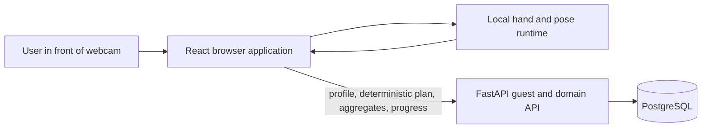
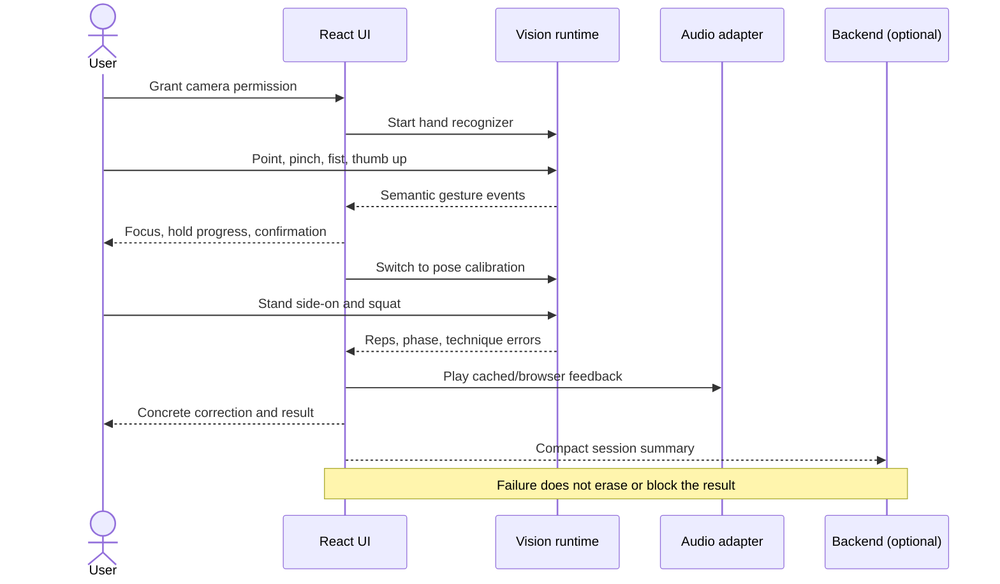
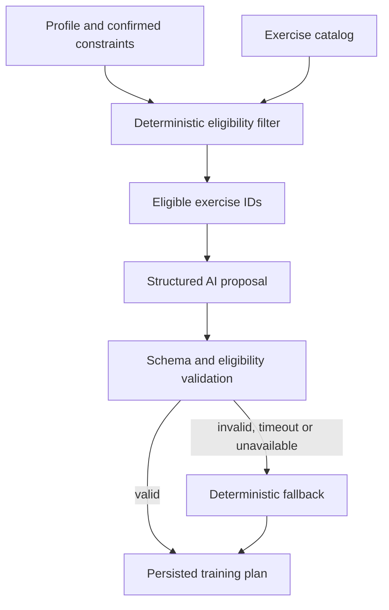

# Dungeon Master Architecture

## 1. Architectural goal

The system must provide a complete, reliable gesture-controlled fitness flow in a
browser while keeping real-time visual processing local. Backend and third-party
integrations enrich the product but do not sit on the critical path of movement
recognition.

## 2. System context



Raw camera frames stay between the browser and the local visual runtime.

## 3. Critical-path architecture



## 4. Frontend architecture

### Application modes

```text
BOOT
  -> CAMERA_PERMISSION
  -> TUTORIAL
  -> MENU
  -> CALIBRATION
  -> COUNTDOWN
  -> WORKOUT
  -> PAUSED
  -> RESULTS

MENU <-> PROFILE
MENU <-> PLAN
MENU <-> PROGRESS
```

The top-level mode machine determines which recognizer and commands are active.
This prevents exercise movement from accidentally triggering menu controls.
PROFILE/PLAN/PROGRESS use the existing hand recognizer and gesture target registry;
pose runs only in CALIBRATION/COUNTDOWN/WORKOUT/PAUSED. Fist Back and pinch selection
pass through the existing semantic event mapper, with no duplicated inference
loops or new camera permission requests.

### Layers

| Layer | Owns | Does not own |
|---|---|---|
| `app/` | startup, providers, route and mode orchestration | landmark math |
| `pages/` | route composition | business or vision rules |
| `features/` | feature UI, low-frequency state and actions | inference internals |
| `vision/` | camera samples, geometry, state machines and semantic events | React and backend calls |
| `audio/` | browser speech and cached clip playback | technique policy |
| `api/` | typed HTTP client | visual events |
| `store/` | profile, selected plan and session summary | frame-by-frame values |
| `shared/` | generic UI and utilities | feature-specific rules |

### Visual event boundary

The visual core publishes semantic events rather than operating the UI directly.
UI code maps events to application actions.

Example:

```text
gesture.confirmed { command: "select", targetId: "start-squat" }
  -> app action START_CALIBRATION
  -> route/mode update
  -> recognizer switch
```

## 5. Backend architecture

The existing backend contract remains authoritative:

```text
HTTP endpoint
  -> Pydantic schema
  -> controller
  -> model function
  -> PostgreSQL
```

Deferred Sprint 4 provider flow (not implemented):

```text
endpoint
  -> controller loads primitive data through model functions
  -> transaction ends
  -> controller calls provider adapter
  -> controller validates business outcome
  -> one model function persists final result
```

Network I/O never occurs inside an open database transaction.

### Backend domains

- `users`: guest and future registered identities.
- `profiles`: goal, experience, schedule, equipment and locale.
- `exercises`: allowlisted catalog and analysis metadata.
- `training_plans`: deterministic plans and nested plan items.
- `workout_sessions`: session and set summaries.
- `progress`: aggregate read queries.

Integration/calendar and voice-asset domains are deferred; no such runtime
capabilities or tables are added in Sprint 3.

## 6. Deferred Sprint 4 AI plan generation



The model never receives freedom to invent exercises outside the catalog.

## 7. Session-summary contract

The browser sends only schema-controlled aggregates:

- client session/set UUIDs and an optional owned plan ID;
- aware timestamps, total duration and engine version;
- total, accepted and rejected repetitions;
- depth_insufficient, too_fast and incomplete_extension counts;
- finite mean repetition duration and mean minimum knee angle.

The browser does not send:

- video;
- still images;
- continuous raw landmarks;
- audio recordings;
- inferred diagnoses.

## 8. Reliability strategy

| Dependency failure | Required behavior |
|---|---|
| Backend unavailable | Local workout and result remain usable |
| AI unavailable | Deterministic seeded plan |
| Calendar unavailable | Show retryable sync status |
| ElevenLabs unavailable | Browser speech or cached local clip |
| Hand lost | Freeze cursor, show concrete recovery hint |
| Body partially missing | Pause counting, explain how to reposition |
| Low frame rate | Reduce inference rate or model complexity, preserve UI |
| Camera denied | Explain browser permission recovery and allow retry |

## 9. Deployment

Agents configuring the owner's VPS or CD should read
[the Sprint 4A VPS/CD guide](VPS_CD_AGENT_GUIDE.md) before editing deployment files.
The implemented [deployment workflow and operations](../deploy/README.md) use
same-origin HTTPS/Nginx, an isolated production Compose project and SHA/digest
release verification. Backend binds localhost port 8020 on the shared VPS.

Recommended deployment split:

- Static frontend on a platform that serves HTTPS.
- FastAPI container with PostgreSQL.
- CORS restricted to the deployed frontend origin.
- Provider keys only in backend environment variables.
- Local model assets shipped with the frontend build.
- Health and readiness endpoints monitored independently.

## 10. Architecture decisions

See:

- `decisions/0001-local-visual-inference.md`
- `decisions/0002-preserve-backend-layering.md`
- `decisions/0003-fallback-first-demo.md`


## 11. Sprint 3 persistence and failure flow

Backend bootstrap runs alongside the explicit camera flow, outside the vision
and gesture inference loops. One typed singleton store uses cancellable requests
with bounded timeouts. A saved token is checked against the persisted guest;
missing/401 creates one guest. Profile 404 creates the default full profile.
Catalog eligibility precedes deterministic generation; current plan is reused if
available and still eligible. Explicit profile changes/regeneration archive the
old plan atomically. Only confirmed constraints influence canonical eligibility.

At workout start, App captures a local UUID/start timestamp and optional selected
plan ID. The local vision result remains the immediate UI truth. App first
transitions to RESULTS, then an effect projects aggregate data into the pending
queue and starts background session → set → complete synchronization. No request
is awaited by the workout completion event. API failure cannot remove completed
rep data, hide Results or block camera/calibration.

The model layer owns all transaction boundaries. Plan archive/create/items,
profile/constraint replacement and each idempotent session operation are atomic.
Conditional parent UPDATEs guard concurrent set/completion operations; a partial
unique index enforces one active plan per user. No explicit locks, generic
repositories, ORM rewrite or controller-managed transactions are introduced.

Queue storage is bounded to 20 aggregate entries; successful sync removes entries.
Retry triggers are startup, browser online, bootstrap and manual action, with no
polling loop. Each entry retains client IDs and guest ownership metadata (never a
user_id API field). Owned entries are never transferred to another guest after
401 recovery. Default guest JWT lifetime is 60 minutes; without a refresh
credential, expiry creates a new guest, leaving old data attached to its identity.

Local draft/profile and cached Progress are marked honestly. Storage failure uses
memory with a visible persistence limitation. Queue capacity exhaustion leaves
the immediate result visible and reports that it could not be queued. Progress
aggregates only persisted, owned completed sessions and never invents offline data.

WorkoutFeedbackBanner is presentation-only: short corrections, dense contrast,
large responsive text, stable height, live region and held visibility for transient
errors. It does not own technique thresholds. Local speech remains supplementary.
Live distance/camera verification is pending, as recorded in the manual checklist.

## Sprint 4A extension

The existing API/schema/controller/model boundaries remain. `controllers.ai_coach` orchestrates profile synthesis, retrieved confirmed sources, strict plan output and one spec repair via `ai.openai`; provider work never holds a model database session. Seven small AI/document tables extend existing plan/catalog/session storage. The browser interprets declarations in `vision/exercises/generic` inside the existing PoseSession/RealVisionSource. AI supplies data, not React/layout/code. Frames/landmarks stay local; existing sync persists aggregates and progress. Read [AI personalization](AI_PERSONALIZATION.md), [MovementSpec](MOVEMENT_SPEC_V1.md) and [Figma mapping](FIGMA_SPRINT_4A_MAP.md).

### Sprint 4A URL and browser history

`app/router/routes.ts` maps AppMode and context steps to paths;
`useBrowserRoutes.ts` synchronizes the native History API and preserves Vite's
base prefix and query-controlled jury entry. AppMode still owns counting gates.
Browser traversal dispatches `NAVIGATE`, which permits planning screens, retains
an existing result, and normalizes camera destinations to fresh calibration
(or plan when no exercise is selected). History never stores a runtime/calibration
snapshot. Automatic countdown/pause updates replace history entries. Camera
resources are disposed when leaving coaching; hand-mode transitions keep their
existing runtime. Direct session links cannot manufacture a workout or result.
The frontend host needs an index.html fallback for application deep links.
